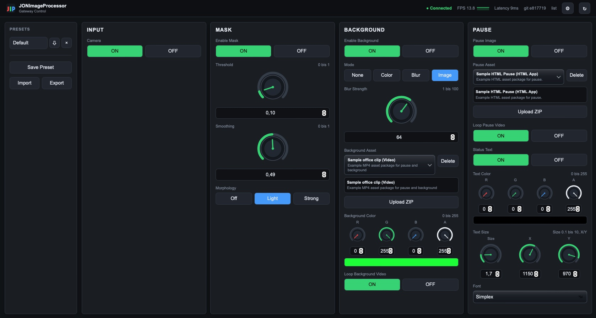

# JONImageProcessor-Gateway

Node.js gateway for the local `JONImageProcessor` runtime IPC API. The gateway exposes an authenticated HTTP JSON API, a WebSocket API, and file-management endpoints for media folders that are needed by the remote UI.



`JONImageProcessor` itself speaks NDJSON over a Unix domain socket, usually `/tmp/jonimageprocessor.sock`. This gateway validates incoming commands against a local JSON schema, forwards allowed IPC requests to that socket, and handles media upload/delete separately through configured working directories.

## Requirements

- Node.js 20 or newer. Node.js 22 is recommended.
- A running `JONImageProcessor` process with IPC enabled.
- The gateway user must have read/write access to the configured media folders and access to the Unix socket.
- npm project dependencies installed with `npm install`.

## Install

Default deployment layout:

```bash
/opt/JONImageProcessor-Gateway/bin/server.js
/opt/JONImageProcessor-Gateway/src/
/opt/JONImageProcessor-Gateway/public/
/opt/JONImageProcessor-Gateway/node_modules/
/opt/JONImageProcessor-Gateway/etc/gateway.config.json
/opt/JONImageProcessor-Gateway/etc/token.env
```

Install or update the application from a checkout on the target machine:

```bash
scripts/install-local.sh
```

The installer prints each step, aborts on the first failing command, runs `git pull --ff-only` when the checkout contains `.git`, installs runtime npm dependencies, writes `src/version-info.json`, stops the systemd service if it exists, copies the runtime files to `/opt/JONImageProcessor-Gateway`, and starts the service again. A failed `git pull`, blocked checkout, failed npm install, or failed copy is visible because the script exits non-zero.

By default the installer also merges missing schema entries from `config/gateway.config.example.json` into the active `/opt/JONImageProcessor-Gateway/etc/gateway.config.json`. Existing local values, paths, tokens, and customized command rules are preserved; only missing keys/items and enum values are added, and a timestamped `.bak` copy is written before the merge. This keeps new WebUI controls visible after updates without replacing local configuration.

Common overrides:

```bash
RUN_GIT_PULL=0 scripts/install-local.sh
PREFIX=/srv/JONImageProcessor-Gateway scripts/install-local.sh
SERVICE_NAME=my-gateway.service scripts/install-local.sh
INSTALL_CONFIG=always scripts/install-local.sh
INSTALL_CONFIG=missing scripts/install-local.sh
```

`INSTALL_CONFIG` defaults to `merge`. Use `missing` to keep the old behavior of creating the config only when absent. Use `always` only when intentionally replacing it with the example config.

The manual equivalent is:

```bash
npm install --omit=dev
npm run version:write
sudo install -d -m 755 /opt/JONImageProcessor-Gateway
sudo install -d -m 755 /opt/JONImageProcessor-Gateway/bin
sudo install -d -m 755 /opt/JONImageProcessor-Gateway/src
sudo install -d -m 755 /opt/JONImageProcessor-Gateway/public
sudo install -d -m 700 /opt/JONImageProcessor-Gateway/etc
sudo cp -a bin/. /opt/JONImageProcessor-Gateway/bin/
sudo cp -a src/. /opt/JONImageProcessor-Gateway/src/
sudo cp -a public/. /opt/JONImageProcessor-Gateway/public/
sudo cp -a node_modules package.json package-lock.json /opt/JONImageProcessor-Gateway/
sudo cp config/gateway.config.example.json /opt/JONImageProcessor-Gateway/etc/gateway.config.json
```

The files copied to `/opt/JONImageProcessor-Gateway/bin` and `/opt/JONImageProcessor-Gateway/src` are the gateway code. `public` contains the WebUI served by the same Node.js process. `node_modules`, `package.json`, and `package-lock.json` are copied so the installed service has the npm dependencies it needs at runtime.

`npm run version:write` writes `src/version-info.json` from the current Git checkout before the files are copied. The running service does not call `git`, so deployments copied without `.git` still show the correct version from that JSON file.

Install the example systemd unit:

```bash
sudo cp packaging/systemd/jonimageprocessor-gateway.service /etc/systemd/system/jonimageprocessor-gateway.service
sudo systemctl daemon-reload
sudo systemctl enable jonimageprocessor-gateway.service
```

Do not start the service until `/opt/JONImageProcessor-Gateway/etc/gateway.config.json` and `/opt/JONImageProcessor-Gateway/etc/token.env` have been configured.

## Configuration

Copy the example config and edit paths for the target system:

```bash
sudo nano /opt/JONImageProcessor-Gateway/etc/gateway.config.json
```

The important settings are:

- `server.host` / `server.port`: HTTP bind address.
- `server.corsAllowedOrigins`: optional list of browser origins allowed to call the API from another site. Use the future local WebUI from the same origin when possible.
- `jonImageProcessor.ipcSocket`: Unix socket exposed by `JONImageProcessor`.
- `jonImageProcessor.pollIntervalMs`: interval for polling `list` from the Unix socket and broadcasting state to WebUI clients over WebSocket.
- `files.roots`: named upload/delete roots, for example `backgrounds`, `pause`, and `fonts`.
- `api.commands`: allowed `list`, `get`, and `set` IPC operations plus value validation for each writable key.

The config is also intended as the future WebUI schema. `/api/schema` returns the allowed API shape without secrets.

Media assets for `backgrounds` and `pause` are uploaded as ZIP packages only. Each ZIP must contain exactly one top-level directory. That directory must contain an `info.json` file with:

```json
{
  "name": "Studio Background",
  "version": "1.0.0",
  "description": "Short description for the UI",
  "type": "Image",
  "startFile": "background.jpg"
}
```

Allowed `type` values are `Image`, `Video`, and `HTML App`. `startdatei` is accepted as an alias for `startFile`. The ZIP is unpacked into the configured root as its own asset directory, for example `/opt/JONImageProcessor/var/userdata/background/studio-background/info.json`.

TTF pause text fonts use the separate `fonts` file root. Upload plain `.ttf` files there; the WebUI lists them together with the built-in OpenCV Hershey fonts. When `pause.font` is set to `Inter-Regular`, JONImageProcessor loads `Inter-Regular.ttf` from the read-only IPC value `pause.fontDirectory`. On the Jetson deployment this directory should match the gateway `files.roots.fonts.path`, for example `/opt/JONImageProcessor/var/userdata/fonts`.

`pause.source` selects what JONImageProcessor renders while the primary camera is paused, connecting, or disconnected and `pause.enabled=true`. `image` uses the configured pause asset from `pause.image`; `camera` uses the secondary camera RTP input reported by IPC as `secondaryCamera.rtpPort`. `background.effect=camera` uses the same secondary camera RTP input as an aspect-ratio-preserved replacement background behind the masked primary camera foreground. The RTP port itself is startup configuration in JONImageProcessor and is read-only through the gateway.

For existing deployments, add `pause.source` and `secondaryCamera.rtpPort` to `api.commands.get.keys`, add `"pause.source": { "type": "string", "enum": ["image", "camera"] }` to `api.commands.set.items`, and add `camera` to the `background.effect` enum in `/opt/JONImageProcessor-Gateway/etc/gateway.config.json`.

A complete image asset example is available in `examples/assets/sample-background/`. See `examples/README.md` for ZIP and upload commands.

## Authentication

The gateway requires a token at startup. The easiest setup is an environment file:

```bash
sudo install -m 700 -d /opt/JONImageProcessor-Gateway/etc
printf 'JON_GATEWAY_TOKEN=%s\n' "$(openssl rand -base64 32)" | sudo tee /opt/JONImageProcessor-Gateway/etc/token.env >/dev/null
sudo chmod 600 /opt/JONImageProcessor-Gateway/etc/token.env
```

Clients send the token as:

```http
Authorization: Bearer <token>
```

`X-API-Token: <token>` also works. Query tokens are enabled by default for browser WebSocket clients:

```text
ws://host:8080/api/ws?token=<token>
```

For deployments where the token should not be stored as plaintext in an environment file, put SHA-256 hashes into `auth.tokenSha256` in the config.

## Run Locally

```bash
JON_GATEWAY_TOKEN=dev-token node bin/server.js
```

Use a different config path when needed:

```bash
JON_GATEWAY_CONFIG=/opt/JONImageProcessor-Gateway/etc/gateway.config.json JON_GATEWAY_TOKEN=dev-token node bin/server.js
```

Syntax check:

```bash
npm install
npm run check
```

## HTTP API

The WebUI is served by the gateway at:

```text
http://127.0.0.1:8080/
```

The UI stores the API token in browser local storage and uses the same HTTP JSON API documented below.

The top status row shows the gateway Git hash from `src/version-info.json`. If that commit was exactly on a release tag when `npm run version:write` was executed, the release tag is shown as well. The same row also shows the JONImageProcessor version from IPC `system.version` or `version` when the current processor reports it. FPS, CPU, and memory are read from IPC `benchmark` when benchmark collection is enabled in JONImageProcessor with `--benchmark` or `diagnostics.benchmark=true`. The running service never calls `git`. As an emergency override, set `JON_GATEWAY_GIT_HASH` and optionally `JON_GATEWAY_RELEASE_TAG` in `/opt/JONImageProcessor-Gateway/etc/token.env`.

The gateway also polls the `JONImageProcessor` Unix socket regularly and broadcasts state updates to the WebUI through `/api/ws`. After the UI sends a setting change, the gateway triggers an additional poll. The UI keeps the changed control in a pending state until the polled server state confirms it; if confirmation times out, the control rolls back to the previous value. The browser-side confirmation timeout is configurable in the WebUI settings dialog.

WebUI presets are stored as JONImageProcessor overlay configuration files in the read-only IPC `system.configDirectory` directory, not in browser storage. `Save Preset` writes an overlay JSON file through the gateway, clicking a preset applies it through IPC `set config <name>`, and the preset action menu provides update, rename, JSON export, and delete. The protected `Default` preset maps to `default.json`; if that file does not exist it is shown disabled until the update button creates it remotely. Existing `Default` is applied after user confirmation when the WebUI starts unless that option is disabled in the settings dialog. The preset section also supports JSON import/export for moving overlay configs between systems.

Health is intentionally unauthenticated:

```bash
curl http://127.0.0.1:8080/api/health
```

Read the public schema:

```bash
curl -H "Authorization: Bearer $JON_GATEWAY_TOKEN" \
  http://127.0.0.1:8080/api/schema
```

Forward a validated IPC request:

```bash
curl -H "Authorization: Bearer $JON_GATEWAY_TOKEN" \
  -H "Content-Type: application/json" \
  -d '{"cmd":"get","key":"segmentation.threshold"}' \
  http://127.0.0.1:8080/api/ipc
```

Read runtime FPS, CPU, and memory statistics:

```bash
curl -H "Authorization: Bearer $JON_GATEWAY_TOKEN" \
  -H "Content-Type: application/json" \
  -d '{"cmd":"get","key":"benchmark"}' \
  http://127.0.0.1:8080/api/ipc
```

Set a runtime value:

```bash
curl -H "Authorization: Bearer $JON_GATEWAY_TOKEN" \
  -H "Content-Type: application/json" \
  -d '{"cmd":"set","key":"background.effect","value":"blur"}' \
  http://127.0.0.1:8080/api/ipc
```

List uploaded assets in a configured root. The response contains metadata from `info.json`, not raw file names:

```bash
curl -H "Authorization: Bearer $JON_GATEWAY_TOKEN" \
  http://127.0.0.1:8080/api/files/backgrounds
```

Upload a ZIP asset package with raw HTTP `PUT` or `POST`. `POST` is accepted because `curl --data-binary` uses `POST` unless `-X PUT` is specified:

```bash
curl -X PUT -H "Authorization: Bearer $JON_GATEWAY_TOKEN" \
  --data-binary @studio-background.zip \
  http://127.0.0.1:8080/api/files/backgrounds/studio-background.zip
```

Equivalent `POST` upload:

```bash
curl -H "Authorization: Bearer $JON_GATEWAY_TOKEN" \
  --data-binary @studio-background.zip \
  http://127.0.0.1:8080/api/files/backgrounds/studio-background.zip
```

Delete an asset directory:

```bash
curl -X DELETE -H "Authorization: Bearer $JON_GATEWAY_TOKEN" \
  http://127.0.0.1:8080/api/files/backgrounds/studio-background
```

When a client sets `background.image` or `pause.image`, it sends the asset id, for example `studio-background`. The gateway reads that asset's `info.json`, resolves `startFile`, and forwards the relative package path such as `studio-background/background.jpg` to the `JONImageProcessor` Unix socket API.

List, upload, download, and delete TTF pause fonts:

```bash
curl -H "Authorization: Bearer $JON_GATEWAY_TOKEN" \
  http://127.0.0.1:8080/api/files/fonts

curl -X PUT -H "Authorization: Bearer $JON_GATEWAY_TOKEN" \
  --data-binary @Inter-Regular.ttf \
  http://127.0.0.1:8080/api/files/fonts/Inter-Regular.ttf

curl -OJ -H "Authorization: Bearer $JON_GATEWAY_TOKEN" \
  http://127.0.0.1:8080/api/files/fonts/Inter-Regular

curl -X DELETE -H "Authorization: Bearer $JON_GATEWAY_TOKEN" \
  http://127.0.0.1:8080/api/files/fonts/Inter-Regular
```

For TTF fonts, `pause.font` is set to the safe base name without `.ttf`. Downloads accept either the safe base name or the `.ttf` file name and reject traversal paths. `pause.fontDirectory` is queried over IPC and displayed by the WebUI, but it is not writable through the gateway. `pause.fontAlign` accepts `left`, `center`, or `right`. `pause.source` accepts `image` or `camera`; `background.effect` accepts `none`, `color`, `blur`, `image`, or `camera`; `secondaryCamera.rtpPort` is exposed as a read-only IPC value.

List, write, rename, apply, and delete overlay presets:

```bash
curl -H "Authorization: Bearer $JON_GATEWAY_TOKEN" \
  http://127.0.0.1:8080/api/presets

curl -X PUT -H "Authorization: Bearer $JON_GATEWAY_TOKEN" \
  -H "Content-Type: application/json" \
  -d '{"name":"Meeting Room","values":{"camera.enabled":true,"background.effect":"camera"}}' \
  http://127.0.0.1:8080/api/presets/meeting-room

curl -X POST -H "Authorization: Bearer $JON_GATEWAY_TOKEN" \
  -H "Content-Type: application/json" \
  -d '{"name":"Main Meeting Room"}' \
  http://127.0.0.1:8080/api/presets/meeting-room/rename

curl -X POST -H "Authorization: Bearer $JON_GATEWAY_TOKEN" \
  http://127.0.0.1:8080/api/presets/Main-Meeting-Room/apply

curl -X DELETE -H "Authorization: Bearer $JON_GATEWAY_TOKEN" \
  http://127.0.0.1:8080/api/presets/Main-Meeting-Room
```

Preset names are converted to JONImageProcessor-safe config names containing only letters, digits, `_`, and `-`. The resulting files are stored as `<name>.json` in `system.configDirectory`; rename moves the existing JSON file to the new safe name instead of leaving a duplicate behind. New preset files include gateway metadata at the top level and remain valid JONImageProcessor overlay configs:

```json
{
  "type": "JONImageProcessorGatewayPreset",
  "version": 1,
  "preset": {
    "id": "meeting-room",
    "name": "Meeting Room",
    "createdAt": "2026-06-20T12:00:00.000Z",
    "updatedAt": "2026-06-20T12:00:00.000Z"
  },
  "camera": {
    "enabled": true
  },
  "pause": {
    "source": "image"
  },
  "background": {
    "effect": "blur",
    "blurStrength": 30
  }
}
```

## WebSocket API

Connect to:

```text
ws://127.0.0.1:8080/api/ws?token=<token>
```

Each text message is the same JSON object accepted by `POST /api/ipc`, for example:

```json
{"cmd":"list"}
```

Responses are the JSON responses from `JONImageProcessor`, or a gateway validation error.

## systemd

Install the application under `/opt/JONImageProcessor-Gateway`, configure `/opt/JONImageProcessor-Gateway/etc/gateway.config.json`, and create `/opt/JONImageProcessor-Gateway/etc/token.env` as shown above.

Example systemd unit:

```ini
[Unit]
Description=JONImageProcessor Gateway
After=local-fs.target network-online.target jon-image-processor.service
Wants=network-online.target
Requires=jon-image-processor.service

[Service]
Type=simple
WorkingDirectory=/opt/JONImageProcessor-Gateway
Environment=JON_GATEWAY_CONFIG=/opt/JONImageProcessor-Gateway/etc/gateway.config.json
EnvironmentFile=-/opt/JONImageProcessor-Gateway/etc/token.env
ExecStart=/usr/bin/node /opt/JONImageProcessor-Gateway/bin/server.js
Restart=always
RestartSec=2
User=jonimageprocessor
Group=jonimageprocessor
SupplementaryGroups=video input render debug

[Install]
WantedBy=jon.target
```

Start or restart the service:

```bash
sudo systemctl start jonimageprocessor-gateway.service
```

Inspect logs:

```bash
journalctl -u jonimageprocessor-gateway.service -f
```

The gateway writes JSON log records with systemd/journald priority prefixes. Failed requests include method, path, status, remote address, duration, and the error message. For recent errors:

```bash
journalctl -u jonimageprocessor-gateway.service -p warning -n 100 --no-pager
```

If the Unix socket is owned by another user or group, adjust the `User=`, `Group=`, or supplementary groups in the unit so the gateway can connect to it.
